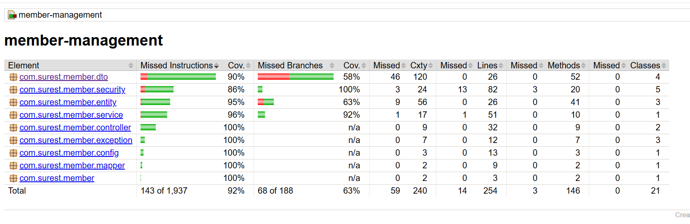
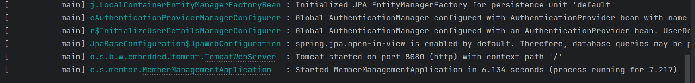

# Member Management Application

## APIs

- GET /api/v1/members/{id}
- PUT /api/v1/members/{id}
- DELETE /api/v1/members/{id}
- GET /api/v1/members
- POST /api/v1/members
- POST /api/v1/auth/login

## Features
- CRUD operations for Member Management API
- JWT-based authentication and role-based authorization
- In-memory caching to improve response performance
- Comprehensive Unit testing with Mockito and JaCoCo coverage reporting
- Integration testing using Testcontainers (Docker-based PostgreSQL)
- Centralized exception handling with global error responses
- Logging with unique request trace for debugging
- API documentation using Swagger/OpenAPI (auto-generated UI)

## Technologies
- Java 17
- Spring Boot 3.5.6
- PostgreSQL 17.6
- Springdoc OpenAPI (Swagger UI)
- Flyway (Database migration)
- JWT (JSON Web Tokens)
- Springdoc OpenAPI (Swagger UI)
- Docker + Testcontainers (Integration testing)
- JUnit 5 & Mockito (Unit testing)
- JaCoCo (Test coverage reporting)

## Tools
- Lombok
- JaCoCo (Code coverage)
- AssertJ (Unit testing assertions)
- JUnit 5 / Spring Boot Test / Spring Security Test
- Postman
- IntelliJ IDEA

## Build Tools / Plugins
- Gradle
- Spring Boot Gradle Plugin 3.5.6
- Spring Dependency Management Plugin 1.1.7
- Java Plugin
- JaCoCo Plugin 0.8.12

## Screenshots

### Code coverage report

### Application running screenshot

